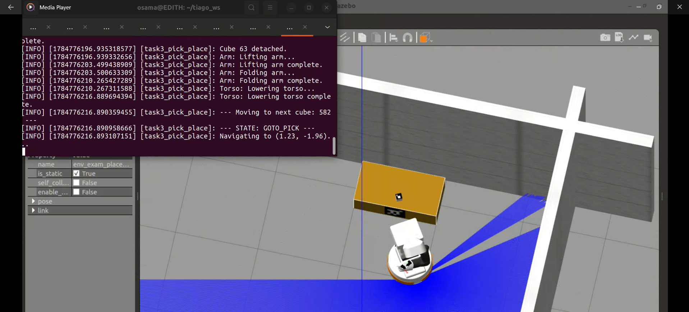

<h1 align="center">TIAGo — Autonomous Mapping, Navigation and Pick &amp; Place</h1>

<p align="center">
  <em>Final project — Autonomous Mobile Robotics, M.Sc. Automation Engineering,<br/>
  University of Bologna</em>
</p>

<p align="center">
  <a href="https://github.com/syed-waleed-ahmed/tiago-autonomous-pick-and-place/actions/workflows/ci.yml"></a>
  
  
  
  
  
</p>

---

A **PAL Robotics TIAGo** robot that maps an unknown indoor environment on its own,
recovers its position from a random start pose, finds the pick and place stations by
looking for ArUco markers, and transports two cubes between them — end to end, with no
teleoperation and no hardcoded coordinates.

| | |
|---|---|
| **Platform** | TIAGo — differential base, 7-DoF arm, parallel gripper, RGB-D head camera |
| **Stack** | ROS 2 Humble · Gazebo Classic · Nav2 · SLAM Toolbox · `explore_lite` · `aruco_ros` |
| **Environment** | `group26` — course-assigned Gazebo world |
| **Language** | Python 3.10 (`rclpy`), ~1,800 lines across two task nodes |

## Contents

- [What the robot does](#what-the-robot-does)
- [Results](#results)
- [Repository layout](#repository-layout)
- [Setup](#setup)
- [Running](#running)
- [Design highlights](#design-highlights)
- [Documentation](#documentation)
- [Authors and license](#authors-and-license)

---

## What the robot does

### Task 1 — Map generation

Frontier-based autonomous exploration builds a complete occupancy grid of the scenario.
`explore_lite` drives Nav2 across the SLAM Toolbox map until no frontier remains, then the
map is saved automatically. The arm is folded first so it does not intrude into the base
laser's field of view and corrupt the map.

**Output:** [`maps/map.pgm`](maps/map.pgm) + [`maps/map.yaml`](maps/map.yaml) — 5 cm/cell.

### Task 2 — Localization and station discovery

The robot starts from a pose *different from the mapping start*, so it must solve global
localization before it can do anything else. It then searches the environment for two
25 cm ArUco markers that identify the manipulation stations — **ID 26** (pick) and
**ID 238** (place) — and navigates to a standoff pose in front of each.

```
INIT → LOCALIZE → DISCOVER_PICK → GOTO_PICK → DISCOVER_PLACE → GOTO_PLACE → DONE
```

**Output:** [`maps/found_markers.yaml`](maps/found_markers.yaml) — the discovered station poses.

### Task 3 — Pick and place

Both cubes are transported from the pick station to the place station in the required
order — **ID 63 first, then ID 582** (7 cm cubes, 7 cm markers). The cubes are located by
a second, separately calibrated ArUco detector; the arm aligns, the gripper visibly
closes, and the Gazebo Link Attacher makes the grasp rigid.

```
INIT → LOCALIZE → GOTO_PICK → DISCOVER_CUBE → GRASP → GOTO_PLACE → PLACE → (repeat) → DONE
```

---

## Results

<table>
<tr>
<td width="50%"><br/><sub><b>Task 1</b> — complete SLAM map of the scenario</sub></td>
<td width="50%"><br/><sub><b>Task 2</b> — AMCL converged, entering marker discovery</sub></td>
</tr>
<tr>
<td width="50%"><br/><sub><b>Task 3</b> — cube 63 grasped and attached</sub></td>
<td width="50%"><br/><sub><b>Task 3</b> — cube 63 placed, navigating back for cube 582</sub></td>
</tr>
</table>

Global localization converged from an unknown pose in every run:

| | cov x | cov y | cov yaw |
|---|---|---|---|
| Initial (uniform distribution) | 6.9973 | 8.9269 | 9.8416 |
| Converged | **0.0610** | **0.0618** | **0.0458** |

Full gallery, per-task evidence and the requirement checklist:
**[`docs/RESULTS.md`](docs/RESULTS.md)**.

---

## Repository layout

```
.
├── tiago_exam/                           ROS 2 package — all project code
│   ├── launch/
│   │   ├── task1_mapping.launch.py         SLAM + frontier exploration + map saver
│   │   ├── task2_navigation.launch.py      Nav2 + ArUco (25 cm) + navigator node
│   │   ├── task3_pick_place.launch.py      Nav2 + ArUco (7 cm) + pick-and-place node
│   │   ├── tiago_exam.launch.py            Simulation bringup (course-provided)
│   │   └── tiago_spawn.launch.py           Robot spawn (course-provided)
│   ├── scripts/
│   │   ├── task2_navigator.py              Localization, marker discovery, navigation
│   │   ├── task3_pick_place.py             Pick-and-place state machine
│   │   └── tuck_arm.py                     Arm folding helper
│   ├── config/
│   │   ├── aruco_params_26.yaml            Pick-station detector parameters
│   │   ├── aruco_params_238.yaml           Place-station detector parameters
│   │   └── tiago.rviz  ·  wbc.rviz         RViz configurations
│   ├── CMakeLists.txt
│   └── package.xml
├── maps/
│   ├── map.pgm  ·  map.yaml                Map produced by Task 1
│   └── found_markers.yaml                  Station poses discovered by Task 2
├── docs/
│   ├── ARCHITECTURE.md                     System design, state machines, ROS interfaces
│   ├── RESULTS.md                          Full results gallery and requirement checklist
│   ├── exam_project_specification.pdf      The assignment
│   └── images/                             Screenshots from recorded runs
└── .github/workflows/ci.yml                Syntax and manifest checks
```

> Only code written for this project is versioned here. The course TIAGo workspace and
> third-party packages are dependencies, not vendored copies — see [Setup](#setup).

---

## Setup

### Prerequisites

- Ubuntu 22.04 with **ROS 2 Humble**
- Gazebo Classic, Nav2, MoveIt 2, `topic_tools`, `rqt_image_view`

### Workspace

```bash
mkdir -p ~/tiago_ws/src && cd ~/tiago_ws/src

# Course TIAGo workspace — supplies tiago_robot, tiago_simulation,
# tiago_navigation, pal_gazebo_worlds and the rest of the simulation stack
git clone https://github.com/ljuba1996/TiagoWorkspace.git .

# Third-party packages used by the tasks
git clone https://github.com/pal-robotics/aruco_ros.git           # marker detection
git clone https://github.com/robo-friends/m-explore-ros2.git      # explore_lite, Task 1
git clone https://github.com/IFRA-Cranfield/IFRA_LinkAttacher.git # grasping, Task 3

# This project
git clone https://github.com/syed-waleed-ahmed/tiago-autonomous-pick-and-place.git
ln -s ~/tiago_ws/src/tiago-autonomous-pick-and-place/tiago_exam ~/tiago_ws/src/tiago_exam
```

### Build

```bash
cd ~/tiago_ws
rosdep install --from-paths src --ignore-src -r -y
colcon build --symlink-install
source install/setup.bash
```

### Map

The Task 2 and Task 3 launch files read the map from `~/tiago_ws/my_map`:

```bash
cp -r ~/tiago_ws/src/tiago-autonomous-pick-and-place/maps ~/tiago_ws/my_map
```

> **World file.** `group26.world` is issued per group by the course instructor and is not
> redistributed here. Either drop your own world into `pal_gazebo_worlds/worlds/`, or
> change `world_name:=group26` to `world_name:=example` in the launch files to use the
> public debug environment.

---

## Running

Each task is a **single launch file**, as the assignment requires.

```bash
# Task 1 — autonomous mapping (~8 min, saves the map automatically at the end)
ros2 launch tiago_exam task1_mapping.launch.py

# Task 2 — global localization + ArUco station discovery (~9 min)
ros2 launch tiago_exam task2_navigation.launch.py

# Task 3 — full pick and place of cubes 63 and 582 (~12 min)
ros2 launch tiago_exam task3_pick_place.launch.py
```

Everything is staged on timers inside each launch file, so a single command brings up
Gazebo, the topic relays, Nav2, the ArUco detectors and the task node in dependency
order. No second terminal is needed.

**Task 2 start pose.** The node teleports the robot to a pose different from the mapping
start in order to demonstrate global localization. Adjust or disable it with the
`test_teleport`, `test_teleport_x`, `test_teleport_y` and `test_teleport_yaw` node
parameters in `launch/task2_navigation.launch.py`.

**If Gazebo will not restart.** A `Ctrl-C` sometimes leaves `gzserver` alive, which breaks
the next launch:

```bash
ps -ef | grep ros
kill -9 <pid>
```

---

## Design highlights

**No hardcoded positions.** Every navigation goal and arm target is computed at runtime.
Station standoff poses are built with PyKDL as a 0.6 m offset along the detected marker's
outward normal; cube grasp poses come straight from the cube detector in
`base_footprint`. Nothing in the source assumes where anything is.

**Convergence-gated localization.** Rather than waiting a fixed time for AMCL, the node
gates on covariance (`cov_xy < 0.07`, `cov_yaw < 0.15`), spins for at least 2.5 rotations
to feed the particle filter varied laser geometry, and applies a short translation nudge
if convergence stalls — which is what breaks the symmetric-corridor ambiguity a pure
in-place spin cannot resolve.

**Map-aware search instead of waypoints.** Patrol viewpoints are rejection-sampled from
the live `/map` occupancy grid with 0.8 m wall clearance and 2 m spacing, so the search
generalises to any world rather than being tuned to `group26`.

**Two ArUco detectors, correctly calibrated.** Station markers are 25 cm and cube markers
are 7 cm; ArUco pose error scales with the mismatch between configured and true marker
size, so Task 3 runs a second `marker_publisher` at `marker_size:=0.07` remapped to its
own topic.

**Detections are filtered, not trusted.** A marker is only promoted to a target after
repeated consistent observations inside range and height gates — 3 detections within
0.5 m for stations, 2 within 5 cm for cubes.

**Reactive safety on top of Nav2.** An independent `/scan_raw` monitor (32° cone, 0.40 m,
3-frame debounce) cancels the goal and runs a back-up-and-escape manoeuvre that picks the
freest of 12 angular sectors, covering the cases Nav2's own recovery behaviours leave
open.

**Standard ROS mechanisms only.** Publishers/subscribers, action clients
(`NavigateToPose`, `FollowJointTrajectory`) and service clients (`AttachLink`,
`DetachLink`, `/reinitialize_global_localization`) throughout — no ROS topics or services
driven through shell subprocesses inside a node.

---

## Documentation

| Document | Contents |
|---|---|
| [`docs/ARCHITECTURE.md`](docs/ARCHITECTURE.md) | System diagram, launch sequencing, state machines, tuned parameters, full ROS interface tables, known limitations |
| [`docs/RESULTS.md`](docs/RESULTS.md) | Annotated screenshots per task, measured convergence trace, requirement checklist, runtimes |
| [`docs/exam_project_specification.pdf`](docs/exam_project_specification.pdf) | The original assignment |

---

## Authors and license

**Group 26** — M.Sc. Automation Engineering, University of Bologna.
Course: Autonomous Mobile Robotics, Prof. Alessio Caporali (DEI–LAR).

Code in `tiago_exam/` is released under the **Apache License 2.0**, matching the upstream
PAL Robotics TIAGo packages it builds on. See [`LICENSE`](LICENSE).

The assignment PDF in `docs/` is course material by Prof. Alessio Caporali and is
included for reference only.
