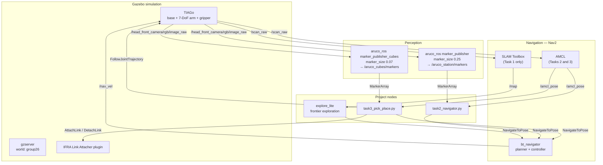
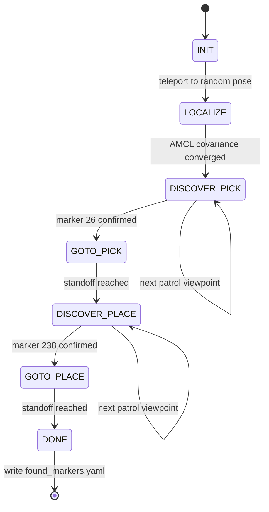
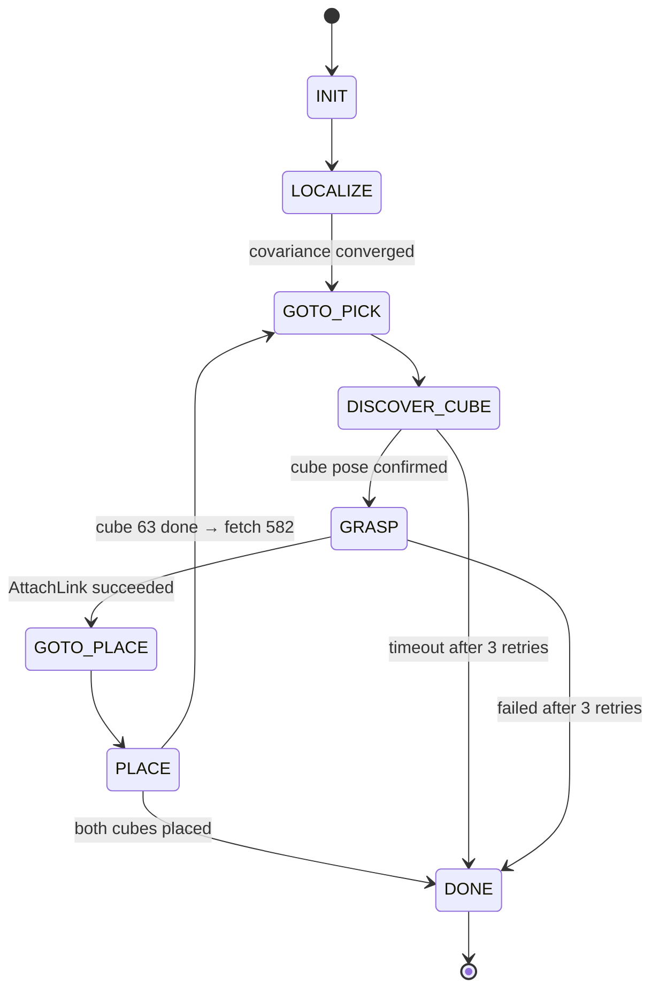

# Architecture

Technical design of the three task pipelines. See [`RESULTS.md`](RESULTS.md) for the
recorded outcomes and the [assignment PDF](exam_project_specification.pdf) for the
original requirements.

---

## 1. Design principles

The assignment sets three hard constraints that shaped every decision:

| Requirement | How it is satisfied |
|---|---|
| *"3 launch files to launch each of the 3 tasks"* | Each task is one self-contained launch file that brings up simulation, navigation, perception and the task node. |
| *"Use ROS functionalities as they are intended… no calling ROS topics or services as subprocesses within another node"* | All node-internal communication uses publishers/subscribers, action clients and service clients. `ExecuteProcess` appears only in launch files, where it is the intended mechanism. |
| *"The use of hardcoded positions for pick and place will be negatively evaluated"* | Every navigation goal and every arm target is derived at runtime from ArUco detections transformed through the TF tree. No map coordinates are baked into the source. |

A fourth, self-imposed principle: **the nodes must not assume the `group26` world.**
Patrol viewpoints are sampled from the live occupancy grid, and station poses come from
marker normals — so the same code runs in any of the course worlds.

---

## 2. System overview



### Topic relays

The course TIAGo stack and stock Nav2 disagree on topic names. Rather than patch the
vendored packages, each launch file starts three `topic_tools relay` processes:

| From | To | Why |
|---|---|---|
| `/mobile_base_controller/odom` | `/odom` | Nav2 expects the standard odometry topic |
| `/scan_raw` | `/scan` | Nav2 costmap observation source |
| `/nav_vel` | `/mobile_base_controller/cmd_vel_unstamped` | Nav2 velocity output → TIAGo base controller |

This keeps the project's dependencies to a clean, un-forked upstream.

### Launch sequencing

Nav2, the ArUco detectors and the task nodes each need the previous stage's topics and
TF frames to exist before they start, so every launch file staggers startup with
`TimerAction`:

| | Task 1 | Task 2 | Task 3 |
|---|---|---|---|
| Gazebo + TIAGo | 0 s | 0 s (`moveit:=true`) | 0 s (`moveit:=true`) |
| Fold arm | 20 s | — | — |
| Topic relays | 25–30 s | 5 s | 5 s |
| Nav2 | 40 s (`slam:=True`) | 15 s (`map_path`) | 15 s (`map_path`) |
| ArUco detector | — | 25 s (0.25 m) | 25 s (0.07 m) |
| Task node | 55 s (`explore_lite`) | 35 s | 50 s |
| Map saver | 475 s | — | — |

Task 3 waits until 50 s because AMCL needs a settled TF tree before global localization
is meaningful.

---

## 3. Task 1 — Map generation

Fully autonomous, no teleoperation. `explore_lite` selects frontiers on the SLAM Toolbox
occupancy grid and issues `NavigateToPose` goals until no frontier remains; the launch
file then invokes `map_saver_cli`.

The one non-obvious step is **folding the arm at t = 20 s** before exploration begins.
TIAGo's default arm pose intrudes into the base laser's field of view, which paints
phantom obstacles into the map and makes frontier selection thrash. The fold goal
`[2.6, -1.5, 0.6, 2.0, 1.2, -1.39, 2.0]` clears the laser plane.

Result: a complete 5 cm/cell grid of the scenario, `origin [-3.49, -8.24, 0]`, saved to
[`../maps/`](../maps).

---

## 4. Task 2 — Localization and station discovery

`scripts/task2_navigator.py`, node name `aruco_navigator`.



### 4.1 Global localization

The robot is started from a pose different from the mapping start, so AMCL must solve the
global problem. The node calls `/reinitialize_global_localization` and then **gates on
covariance rather than on elapsed time**:

```python
AMCL_COV_XY  = 0.07
AMCL_COV_YAW = 0.15
LOCALIZE_MIN_ROTATIONS = 2.5
LOCALIZE_RETRIGGER_EVERY = 40.0
```

The base spins at 0.4 rad/s for at least 2.5 rotations to feed the particle filter varied
laser geometry. If covariance has not converged after 40 s the global initialisation is
re-triggered, and a short 0.15 m/s translation nudge is applied — this breaks the
symmetric-corridor ambiguity that a pure in-place spin cannot resolve. Hard timeout
150 s.

### 4.2 Patrol viewpoint sampling

Rather than hardcoded search waypoints, candidate viewpoints are drawn from the live
`/map` `OccupancyGrid`:

| Constraint | Value |
|---|---|
| Minimum clearance from any occupied cell | 0.80 m |
| Minimum spacing between viewpoints | 2.00 m |
| Viewpoints generated | 8 |
| Rejection-sampling attempts | up to 400 |

At each viewpoint the robot performs a full `2π / 0.25 rad/s` sweep with the head pitched
to −0.05 rad, giving the ArUco detector a complete panorama.

### 4.3 Detection filtering

A raw ArUco stream contains false positives, especially at grazing angles. A detection is
only promoted to a station pose once it passes:

| Gate | Value |
|---|---|
| Range | 0.30 m – 6.00 m |
| Height above floor | 0.00 m – 2.20 m |
| Consistent detections required | 3 |
| Within radius | 0.50 m |

### 4.4 Standoff pose from the marker normal

The navigation goal is *not* the marker position. Using PyKDL, the marker frame is read
from TF and a goal frame is constructed 0.60 m along the marker's outward normal, with
the robot's heading set to face the marker:

```
goal = T_map←marker · Frame(rot_align, Vector(0, 0, APPROACH_DIST))
```

This yields a pose the arm can work from, and it generalises to any station placement.

### 4.5 Reactive safety layer

Nav2's recovery behaviours do not cover every case in cluttered rooms, so a
`/scan_raw` subscriber runs an independent monitor:

| Parameter | Value |
|---|---|
| Front cone | 32° |
| Stop distance | 0.40 m |
| Debounce | 3 consecutive frames |
| Back-up | 1.2 s |
| Escape sectors evaluated | 12 |
| Consecutive emergencies before full recovery | 3 |

On trigger, the node cancels the Nav2 goal, backs up if the rear is clear
(> 0.50 m), rotates toward the freest of 12 angular sectors, drives forward 1.0 s, and
re-issues the goal.

### 4.6 Output

On success the node writes both station poses to `found_markers.yaml`:

```yaml
marker_26:   { x: 1.2259, y: -1.9627, z: 0.0, qz: -0.1985, qw: 0.9801 }   # pick
marker_238:  { x: 1.2921, y: -7.1602, z: 0.0, qz:  0.8997, qw: -0.4365 }  # place
```

---

## 5. Task 3 — Pick and place

`scripts/task3_pick_place.py`, node name `task3_pick_place`.



### 5.1 Two independent ArUco detectors

Station markers are 25 cm; cube markers are 7 cm. A single detector cannot be calibrated
for both — pose error scales with the mismatch between the configured and the true marker
size. Task 3 therefore runs a **second** `marker_publisher` instance:

| Instance | `marker_size` | `reference_frame` | Output topic |
|---|---|---|---|
| `marker_publisher` | 0.25 | `base_footprint` | `/aruco_station/markers` |
| `marker_publisher_cubes` | 0.07 | `base_footprint` | `/aruco_cubes/markers` |

Cube poses arrive directly in `base_footprint`, which is the natural frame for arm
targets and avoids a TF round-trip through `map`.

### 5.2 Cube detection gating

Tighter than the station gates, because the arm commits to the result:

| Gate | Value |
|---|---|
| Range | 0.15 m – 2.00 m |
| Consistent detections | 2 |
| Within radius | 0.05 m |
| Search timeout | 20 s |

### 5.3 Manipulation sequence

Joint groups are driven through four separate `FollowJointTrajectory` action clients
(`arm_controller`, `torso_controller`, `gripper_controller`, `head_controller`):

| Phase | Torso | Head pitch | Gripper |
|---|---|---|---|
| Navigating | 0.10 m | −0.35 rad | closed |
| Cube search | 0.20 m | −0.55 rad | — |
| Grasp | 0.20 m | −0.55 rad | 0.044 → 0.030 m |
| Place | 0.20 m | −0.60 rad | 0.030 → 0.044 m |

`ARM_FOLD = [2.6, -1.5, 0.6, 2.0, 1.2, -1.39, 2.0]` is the transit pose;
`BASE_REACH = [1.44, 0.50, -0.40, 1.20, 0.60, -0.30, 2.00]` is the pre-grasp pose from
which the descent to the detected cube height is computed.

### 5.4 Grasping

The assignment permits the Link Attacher plugin but requires visible gripper actuation
and reasonable end-effector alignment. The node therefore:

1. Aligns the end-effector over the detected cube pose and descends.
2. Commands a **real gripper trajectory** (0.044 → 0.030 m on both finger joints) — the
   closing is visible in simulation.
3. Only then calls `/ATTACHLINK` to make the grasp rigid.
4. At the place location, descends, calls `/DETACHLINK`, and opens the gripper.

No simulation friction or physics parameters were modified.

### 5.5 Concurrency

The node runs on a `MultiThreadedExecutor` with a `ReentrantCallbackGroup`. Without this,
the ArUco and AMCL callbacks would starve while a blocking `FollowJointTrajectory` goal
is in flight, and the node would act on stale perception.

### 5.6 Failure handling

`MAX_RETRIES = 3` per phase. Each phase reports its own failure reason and the machine
transitions to `DONE` rather than hanging, so a run always terminates with a clear
verdict in the log.

---

## 6. ROS interface summary

### Subscribed

| Topic | Type | Used by |
|---|---|---|
| `/map` | `nav_msgs/OccupancyGrid` | Task 2 (patrol sampling) |
| `/amcl_pose` | `geometry_msgs/PoseWithCovarianceStamped` | Tasks 2, 3 |
| `/scan_raw` | `sensor_msgs/LaserScan` | Task 2 (safety monitor) |
| `/aruco_station/markers` | `aruco_msgs/MarkerArray` | Task 2 |
| `/aruco_cubes/markers` | `aruco_msgs/MarkerArray` | Task 3 |

### Published

| Topic | Type |
|---|---|
| `/mobile_base_controller/cmd_vel_unstamped` | `geometry_msgs/Twist` |

### Action clients

| Action | Type |
|---|---|
| `navigate_to_pose` | `nav2_msgs/NavigateToPose` |
| `arm_controller/follow_joint_trajectory` | `control_msgs/FollowJointTrajectory` |
| `torso_controller/follow_joint_trajectory` | `control_msgs/FollowJointTrajectory` |
| `gripper_controller/follow_joint_trajectory` | `control_msgs/FollowJointTrajectory` |
| `head_controller/follow_joint_trajectory` | `control_msgs/FollowJointTrajectory` |

### Service clients

| Service | Type |
|---|---|
| `/reinitialize_global_localization` | `std_srvs/Empty` |
| `/ATTACHLINK` | `linkattacher_msgs/AttachLink` |
| `/DETACHLINK` | `linkattacher_msgs/DetachLink` |

---

## 7. Known limitations

- **Task 1 map saving is on a fixed 475 s timer**, not on an `explore_lite` completion
  signal. Exploration finishes well inside that window in the `group26` world, but a
  larger world would need the timer raised or the saver triggered from the
  "all frontiers traversed" event.
- **Task 2 patrol sampling is stochastic.** With an unlucky viewpoint draw the discovery
  phase can take noticeably longer, though the 8-viewpoint, 2 m-spacing configuration
  covered the scenario reliably across our runs.
- **Cube grasping assumes a top-down approach** on a horizontal surface. Cubes on a
  tilted or elevated surface outside the torso's 0.10–0.20 m range are not handled.
- **The reactive safety layer can fight Nav2's own recovery** in tight corners; the
  `MAX_CONSECUTIVE_EMERGENCIES = 3` counter exists to break that loop.
