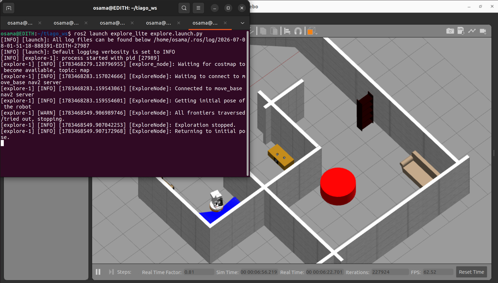
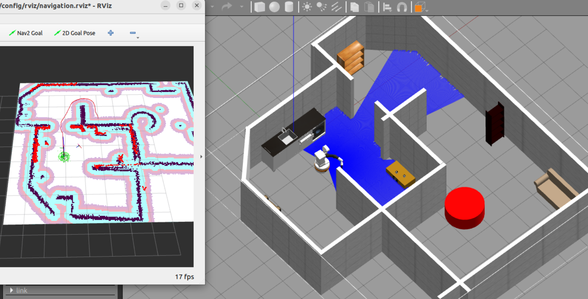
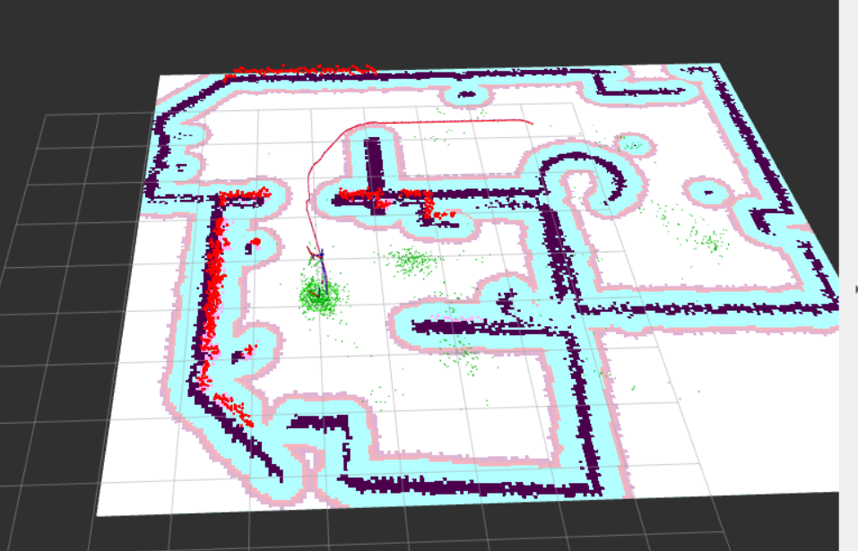
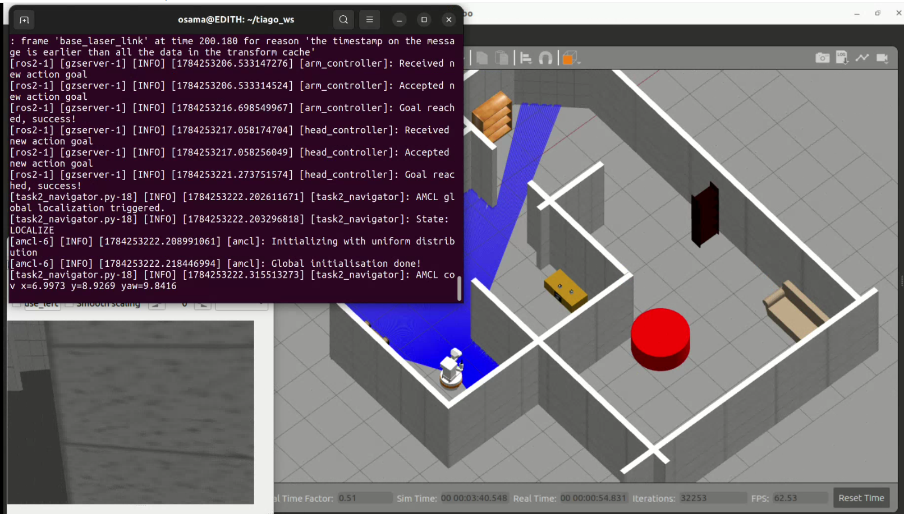
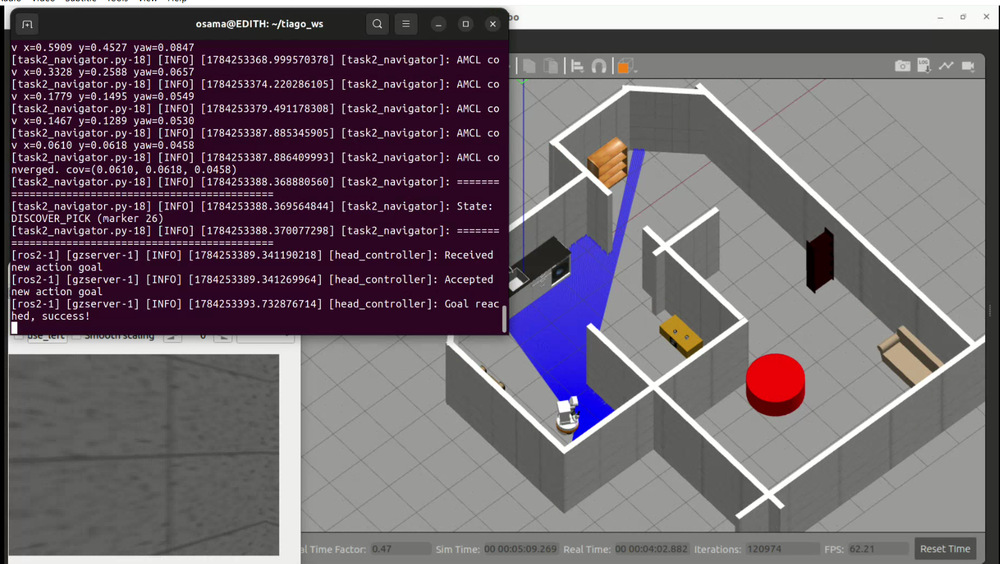
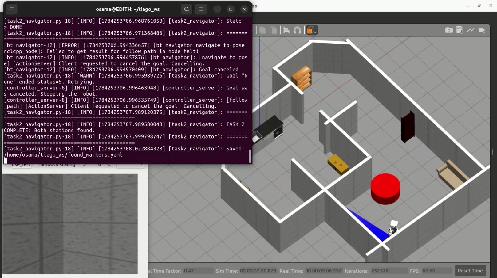
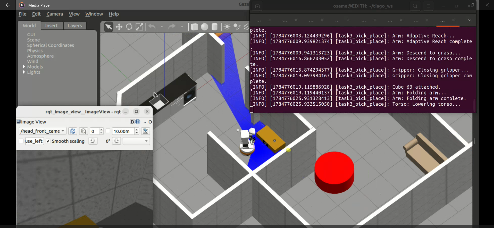
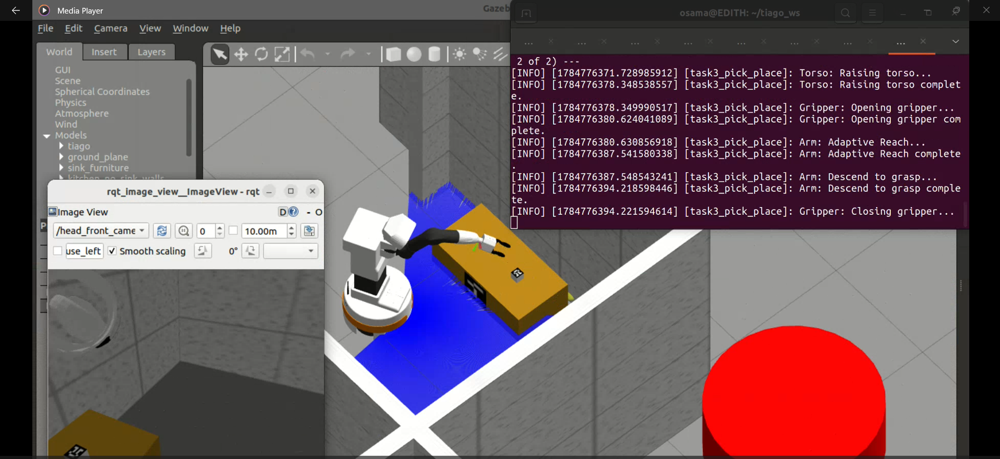
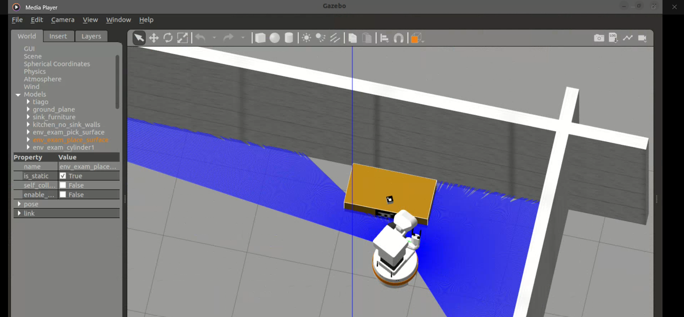
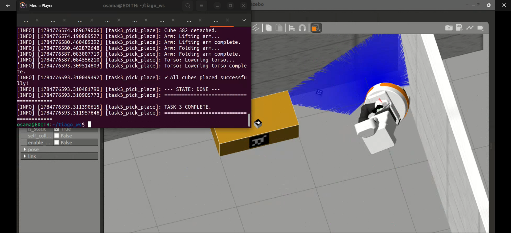

# Results

Recorded outcomes for the three tasks in the `group26` simulation environment.
All screenshots are from complete end-to-end runs — no manual intervention, no
teleoperation, no hardcoded goals.

| Task | Requirement | Outcome |
|---|---|---|
| 1 — Map generation | Autonomously map the whole scenario | Complete map, exploration self-terminated |
| 2 — Navigation | Localize from a random pose, discover and reach both ArUco stations | Both stations found and reached, poses persisted |
| 3 — Pick and place | Transport cube 63 then cube 582 from pick to place | Both cubes grasped, transported and placed |

---

## Task 1 — Map generation

### Exploration terminates on its own

`explore_lite` traversed every frontier and stopped without intervention — the
`All frontiers traversed/tried out, stopping.` warning is the completion signal, not a
failure.

### Map quality

The generated occupancy grid against the Gazebo ground truth. Walls, doorways and the
furniture footprints line up; the inflation layer (cyan) and the AMCL particle cloud
(green) are shown in RViz.

### Final saved map

Complete coverage of the scenario including the far room and both corridors. Saved at
5 cm/cell with origin `[-3.49, -8.24, 0]` to [`../maps/map.pgm`](../maps/map.pgm) and
[`../maps/map.yaml`](../maps/map.yaml).

---

## Task 2 — Localization and station discovery

### Global localization from an unknown pose

The robot is placed at a pose different from the mapping start.
`/reinitialize_global_localization` scatters a uniform particle distribution — initial
covariance `x = 6.997, y = 8.927, yaw = 9.842` shows the pose is genuinely unknown.

### Convergence

After the spin-and-nudge routine, covariance collapses to
`(0.0610, 0.0618, 0.0458)` — inside the `cov_xy < 0.07`, `cov_yaw < 0.15` gate — and the
node advances to `DISCOVER_PICK`.

**Measured convergence trace** (from the run above):

| Time | cov x | cov y | cov yaw |
|---|---|---|---|
| t₀ | 6.9973 | 8.9269 | 9.8416 |
| +146 s | 0.5909 | 0.4527 | 0.0847 |
| +152 s | 0.3328 | 0.2588 | 0.0657 |
| +157 s | 0.1779 | 0.1495 | 0.0549 |
| +165 s | 0.1467 | 0.1289 | 0.0530 |
| +166 s | **0.0610** | **0.0618** | **0.0458** |

### Both stations discovered

Marker 26 (pick) and marker 238 (place) were both discovered by autonomous patrol and
their standoff poses reached. The node writes the result to `found_markers.yaml`.

**Discovered poses** — see [`../maps/found_markers.yaml`](../maps/found_markers.yaml):

| Marker | Role | x | y | qz | qw |
|---|---|---|---|---|---|
| 26 | pick station | 1.226 | −1.963 | −0.198 | 0.980 |
| 238 | place station | 1.292 | −7.160 | 0.900 | −0.436 |

---

## Task 3 — Pick and place

### Grasping cube 63

Adaptive reach → descend to the detected cube height → gripper closes on the finger
joints → `AttachLink`. The log shows the full sequence ending in `Cube 63 attached.`

### Arm extended over the pick station

The end-effector aligned above the cube before descending. Marker-derived pose only — no
hardcoded arm target.

### Approaching the place station

Navigating to the standoff pose computed from marker 238's normal, arm folded and torso
lowered for transit.

### Both cubes placed

`Cube 582 detached` → arm lift → fold → torso lower → `✓ All cubes placed successfully!`
→ `TASK 3 COMPLETE.`

---

## Requirement checklist

Against the "General Recommendations" section of the
[assignment](exam_project_specification.pdf):

| Requirement | Status |
|---|---|
| 3 launch files, one per task | ✅ `task1_mapping`, `task2_navigation`, `task3_pick_place` |
| Standard ROS mechanisms, no topics/services driven as subprocesses inside nodes | ✅ pub/sub, action clients, service clients throughout |
| Gripper opening/closing clearly visible in simulation | ✅ real `FollowJointTrajectory` on the finger joints, 0.044 ↔ 0.030 m |
| Reasonable end-effector/cube alignment before Link Attacher | ✅ alignment and descent precede `/ATTACHLINK` |
| No modification of simulation friction/physics to avoid the plugin | ✅ untouched |
| No hardcoded pick and place positions | ✅ all goals derived from live ArUco detections |
| Cube order: ID 63 then ID 582 | ✅ `CUBE_SEQUENCE = [63, 582]` |
| Map alignment verified from a random initial pose | ✅ AMCL covariance gate, trace above |

---

## Notes on reproducibility

Runtime on the development machine (real-time factor ≈ 0.4–0.8 in Gazebo):

| Task | Wall-clock |
|---|---|
| 1 — mapping | ≈ 8 min (map saver fires at t = 475 s) |
| 2 — localization and discovery | ≈ 9 min |
| 3 — pick and place, both cubes | ≈ 12 min |

Task 2's discovery phase is stochastic — patrol viewpoints are sampled from the
occupancy grid — so run-to-run timing varies. AMCL convergence itself was consistent
across runs.
